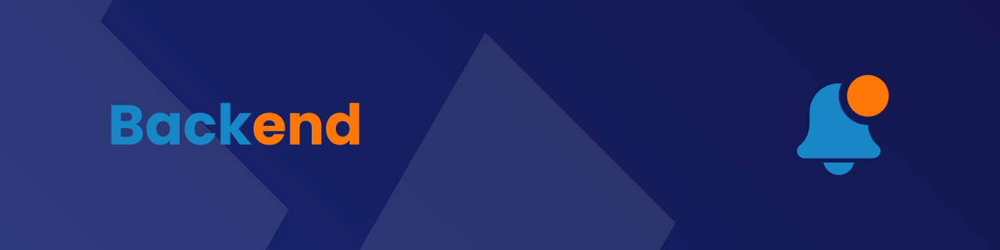

<h1 align="center">
  
</h1>

## ▶️ **Guia de execução do Backend**

1. Entre na pasta do `backend`:
   ```bash
   cd backend
   ```
2. Crie um arquivo de váriaveis de ambiente `.env`;
3. Use um site para gerar uma VAPID KEY - recomendo o [vapidkeys](https://vapidkeys.com);
4. No arquivo `.env` coloque as informações da VAPID KEY:
   ```env
   VAPID_SUBJECT=<subject>
   VAPID_PUBLIC_KEY=<public_key>
   VAPID_PRIVATE_KEY=<private_key>
   ```
5. No arquivo `.env` coloque também a URL do MongoDB:
   ```env
   MONGODB_URL=<mongodb_url>
   ```
   P.S.: Exemplo de `API_BASE_URL` seria `mongodb://localhost/PushNotifications`
6. Execute o comando `yarn install` ou `npm install`;
7. Execute o comando `yarn dev` ou `npm run dev`.

## ⚠️ **Aviso**

Caso queira testar a API no Insominia, deixamos a disposição um arquivo já setado com as informações necessárias. O nome do arquivo é `insominia.json` e se encontra na pasta `backend`.

<a href="https://github.com/js-londrina/web_push_notification">
  
</a>
