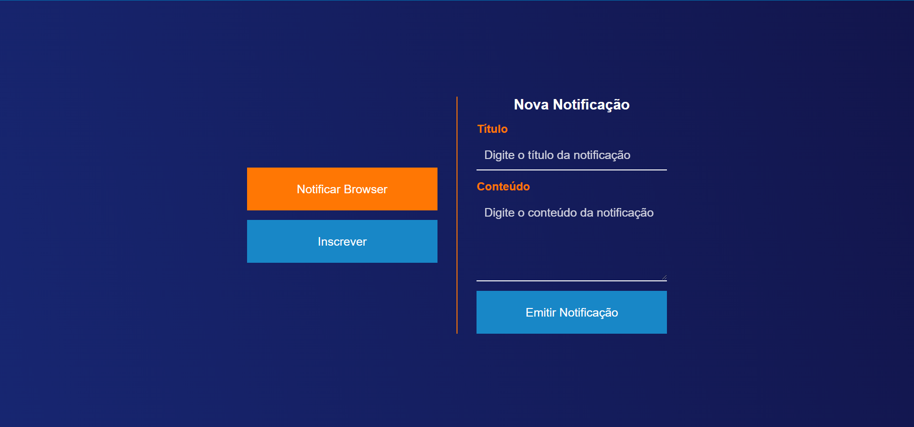

<h1 align="center">
  
</h1>

## 🖥️ **Overview**

<h1 align="center">
  
</h1>

## ▶️ **Guia de execução**

1. Entre na pasta `frontend`:
   ```bash
   cd frontend
   ```
   P.S.: Caso esteja na pasta `backend` de o comando `cd ..` antes de executar o comando a cima.
2. No arquivo `script.js` na linha 1 coloque o PUBLIC KEY da VAPID KEY que foi gerado na configuração do [Backend](https://github.com/lweslen/web_push_notification/backend):
   ```js
   const APP_SERVER_KEY = "<vapid_public_key>";
   ```
3. No arquivo `script.js` coloque também a URL do MongoDB:
   ```js
   const BASE_URL = "<base_url>";
   ```
   P.S.: Exemplo de `API_BASE_URL` seria `http://localhost:3333/api`
4. Clique duas vezes no arquivo `index.html` ou use a exetensão [Live Server](https://marketplace.visualstudio.com/items?itemName=ritwickdey.LiveServer) no VSCode.

<a href="https://github.com/lweslen/web_push_notification">
  
</a>
